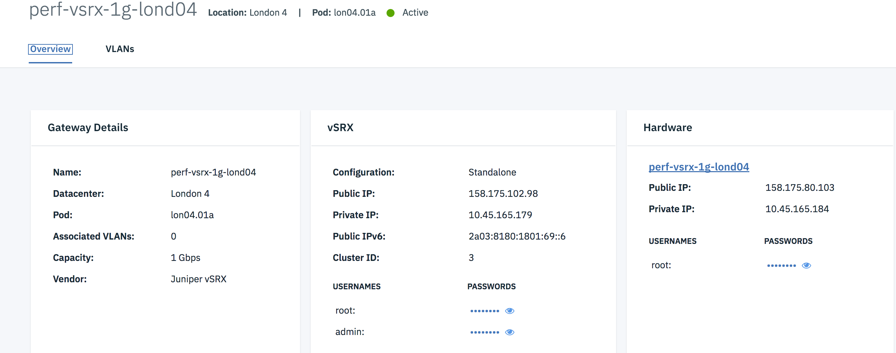

---

copyright:
  years: 2018
lastupdated: "2018-10-22"

---

{:shortdesc: .shortdesc}
{:new_window: target="_blank"}
{:codeblock: .codeblock}
{:pre: .pre}
{:screen: .screen}
{:tip: .tip}
{:download: .download}

# Viewing Your Gateway Appliance Details
{: #viewing-your-gateway-appliance-details}

Network Gateway is used to control network traffic on a VLAN that is regularly controlled by a router. Within the Gateway Appliance Details screen on the Customer Portal, you can associate, disassociate, route and bypass VLANs with a Network Gateway.

Perform the following procedure to access the Gateway Details screen.

1. [Access the Gateway Appliances screen](/docs/infrastructure/vsrx?topic=vsrx-viewing-all-your-gateway-appliances) in the Customer Portal.
2. Click the Gateway Appliance Name for the desired Network Gateway to access the Gateway Appliance Details screen.

Interactions may be taken on multiple VLANs at any given time using the Bulk Actions feature.