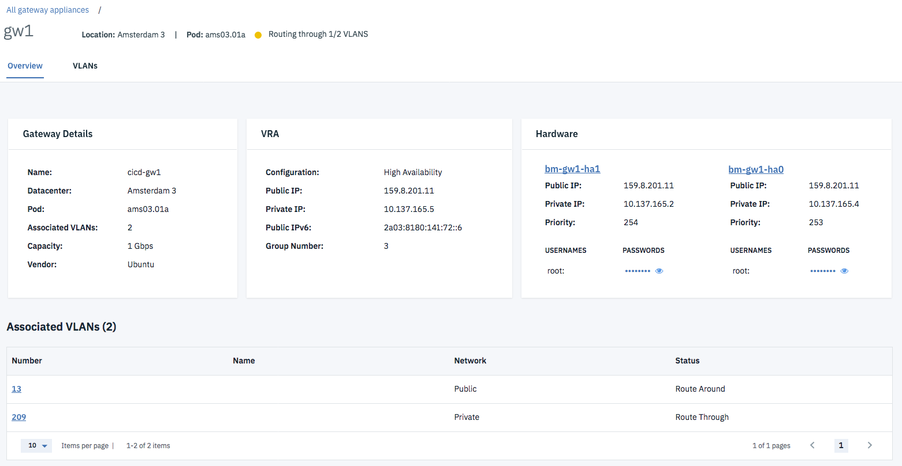

---

copyright:
  years: 2018
lastupdated: "2018-10-22"

---

{:shortdesc: .shortdesc}
{:new_window: target="_blank"}
{:codeblock: .codeblock}
{:pre: .pre}
{:screen: .screen}
{:tip: .tip}
{:download: .download}

# Getting Started

To get started with IBM® Cloud Juniper vSRX Gateway, you should first determine if your account is linked to IBM Cloud. If so, this will slightly alter the ordering process.

To find out if you have a linked account, navigate to the [Customer Portal ](https://control.softlayer.com/){: new_window} in your browser and log in. If your account is unlinked, you will see a **Learn more about Bluemix!** button at the top right.

You can now order your Gateway Appliance, using the appropriate method that follows.

**NOTE:** For a list of Known Limitations with IBM Cloud Juniper vSRX Gateway, refer to [this topic](known-limitations.html).

## Ordering with a linked account
If your account is linked, perform the following procedure:

1.	Open [IBM Cloud ](https://console.cloud.ibm.com/){: new_window} and log into your account.
2.	In the left side navigation, select **Infrastructure > Network > Gateway Appliances**.
3.	From the Gateway Appliances list page, click **Create a Gateway**.
4.	From the Order page, choose a **Hostname** and **Domain** and then select the **High Availability Pair** option if desired.

	

5. Next, select your **Location** of choice along with the associated **Pod** and then choose your **Server** and the desired amount of **RAM**.

	

6. Select a SSH Key if you want to use it to authenticate the access to your new Gateway.
7. Under **Image**, select **Juniper vSRX 15.x (up to 1 Gbps) Standard** for a single processor server.
8. Finish choosing any of the optional add-ons, add additional **Storage Disks**, and choose your **Uplink Port Speed**.
8. Review your selections in the **Order Summary**, read and agree to the 3rd Party Software Terms.
9. Finally, click **Provision**.

## Ordering with an unlinked account
If your account is unlinked, perform the following procedure:

1.	Open the [Customer Portal ](https://control.softlayer.com/){: new_window} and log into your account.
2.	In the Customer Portal navigation, select **Network > Gateway Appliances**.
3.	From the Gateway Appliances list page, click **Order Gateway**.
4.	From the Order page, select your desired data center from the dropdown menu, then choose the desired type of server hardware on which the Juniper vSRX will be provisioned.
5.	On the Order page, select the **High Availability Pair** option if desired, then select the Memory size.
6. Next, click the **Juniper** tab under **Operating System**, select **Juniper vSRX 15.x (up to 1 Gbps) Standard** for a single processor server. Finally, select the desired network uplink speed.
7.	Review your selections, then click **Add to Order**. Your order will be verified automatically.
7.	On the Checkout page, if you already own VLANs in the selected data center, select the back-end VLANs you want to protect. Give a hostname and domain name for your server, select an SSH key for access authentication if desired, and check all boxes for the IBM Cloud service terms and Third Party Software Terms. Click **Submit Order**.

## After ordering
After your order is approved, the provisioning of your vSRX starts automatically. When the provisioning process is complete, the gateway will appear in the Gateway Appliances list page.

Click the gateway name to open the Gateway Details page. You will find the IP addresses, login username, and passwords for the device.

## VLANs and the Gateway Appliance's role
A VLAN (virtual LAN) is a mechanism that segregates a physical network into many virtual segments. For convenience, traffic from multiple selected VLANs can be delivered through a single network cable, a process commonly called "trunking."

vSRX is managed in two different interfaces: The vSRX server(s) and the Gateway Appliance fixture. The Gateway Appliance provides you with an interface (GUI and API) for selecting the VLANs you want to associate with your vSRX. Associating a VLAN with a Gateway Appliance reroutes (or "trunks") that VLAN and all of its subnets to your vSRX, giving you control over filtering, forwarding, and protection. Servers in an associated VLAN can only be reached from other VLANs by going through your vSRX; it is not possible to circumvent the vSRX unless you bypass or disassociate the VLAN.

By default, a new Gateway Appliance is associated with two non-removable "transit" VLANs, one each for your public and private networks. These are typically used for administration and can be separately secured by vSRX commands.

The vSRX can only manage VLANs that are associated with it through the Gateway Appliance.

For information on how to manage VLANs from the Gateway Appliances Details screen, refer to the [Manage VLANs](manage-vlans.html) topic.
