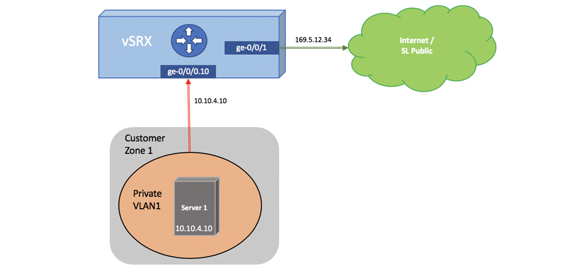

---

copyright:
  years: 2018
lastupdated: "2018-10-22"

---

{:shortdesc: .shortdesc}
{:new_window: target="_blank"}
{:codeblock: .codeblock}
{:pre: .pre}
{:screen: .screen}
{:tip: .tip}
{:download: .download}

# Working with NAT
This topic provides a sample configuration for sNAT on a vSRX appliance. With this configuration, a private node routed behind the Gateway can communicate with the outside world.



```
from-zone CUSTOMER-PRIVATE to-zone SL-PUBLIC {
   policy SNAT {
       match {
           source-address any;
           destination-address any;
           application any;
       }
       then {
           permit;
       }
   }
}

nat {
   source {
       rule-set rs1 {
           from zone CUSTOMER-PRIVATE;
           to zone SL-PUBLIC;
           rule r1 {
               match {
                   source-address 0.0.0.0/0;
                   destination-address 0.0.0.0/0;
               }
               then {
                   source-nat {
                       interface;
                   }
               }
           }
       }
   }
}
```

To configure NAT for the IBM® Cloud Juniper vSRX, refer to this [configuration guide](https://www.juniper.net/documentation/en_US/junos/information-products/pathway-pages/security/security-nat.pdf) on the Juniper website.
