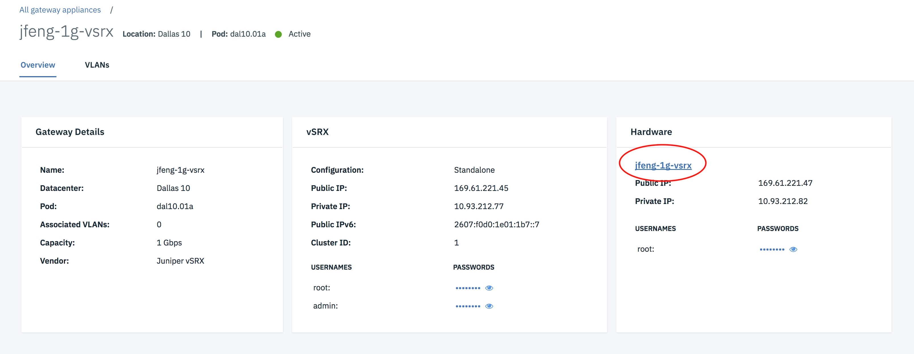
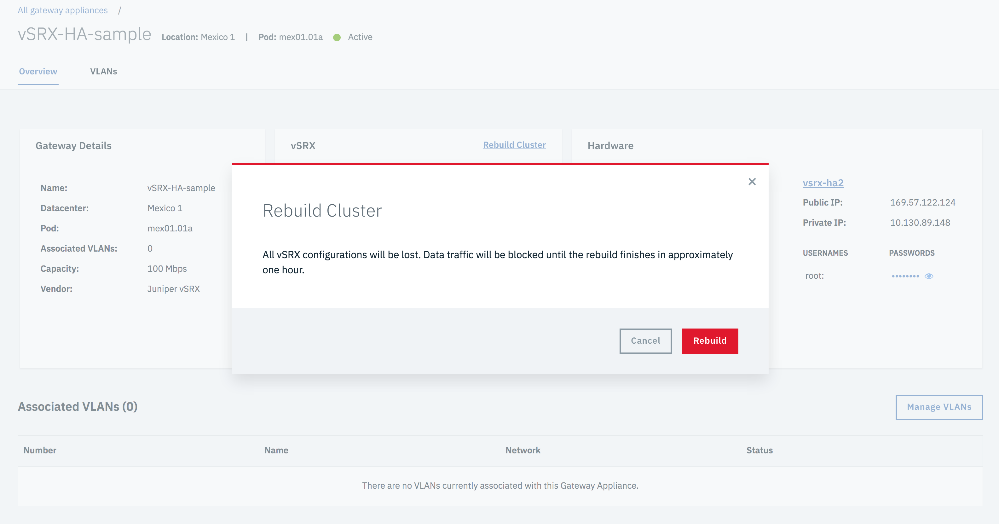

---

copyright:
  years: 2018
lastupdated: "2018-10-22"

keywords: reloading, os, upgrading, kvm, ha, standalone

subcollection: vsrx

---

{:shortdesc: .shortdesc}
{:new_window: target="_blank"}
{:codeblock: .codeblock}
{:pre: .pre}
{:screen: .screen}
{:tip: .tip}
{:note: .note}
{:important: .important}
{:download: .download}

# Reloading the OS
{: #reloading-the-os}

The OS reload process is used to rebuild a gateway server. The process performs the following actions:

* Reload the server host's operating system
* Install KVM in the operating system
* Create a vSRX VM in the KVM
* Reconfigure the vSRX with the default configuration for IBM® Cloud

The process usually requires 1 hour 40 minutes to complete. Standalone Gateways will be out of service during this period. For Juniper High Availability (HA) Gateways, when you reload the OS on one of your servers, the vSRX will failover to another server in the cluster, and continue to process data traffic. Once the reload is complete, the server will rejoin the cluster.

For a successful reload or rebuild of the cluster on an HA vSRX:

* The root password for the provisioned vSRX Gateway must match the root password defined in the vSRX portal. The password in the portal was defined when the Gateway was first provisioned, and may not match the current Gateway password. If the password was changed after the initial provisioning, then use SSH to connect to the vSRX Gateway and change the root password to match. Once the passwords match, you can proceed with the OS Reload or Rebuild Cluster operation.

  

* **Do NOT** perform an OS reload on both servers of the Highly Available gateway at the same time.

Performing an OS reload on both servers of the HA gateway at the same time will destroy the vSRX cluster and cause the gateway to be out of service. If the vSRX cluster is destroyed, you must use the **Rebuild Cluster** option (detailed below) to re-provision vSRX and recreate the HA cluster.
{: important}

* For the Rebuild Cluster option only, the host password(s) must match the password(s) in the vSRX portal. In addition, the host OS must enable root SSH prior to doing a rebuild cluster.

## Performing an OS reload
{: #performing-an-os-reload}

To reload the OS for a gateway server, perform the following procedure:

1. [Access the Gateway Appliances screen](/docs/infrastructure/vsrx?topic=vsrx-viewing-all-your-gateway-appliances) in the Customer Portal, and navigate to the Gateway details page by selecting desired Gateway name.

  

2. Click the server name in the Hardware Panel.

  

3. On the device's page, click **OS Reload** in the Action drop down menu to access the Server Configuration page.

  

4. On the Server Configuration page, you can configure and start the reload. If you're reloading from a different OS, click the **Edit** next to **Operating System**, select **Juniper**, then pick one of the Juniper vSRX 15.x Standard options. When you are done modifying your settings, select **Reload Above Configuration** to continue.

5. The OS Reload details screen displays. Review the settings you have chosen, and click **Edit Settings** if changes are required. Otherwise, click **Next** to proceed.

6. On the OS Reload confirmation screen, agree to the terms of the Master Service Agreement, then begin the OS Reload process by clicking **Confirm OS Reload**. If you do not want to proceed with the reload, click **Cancel**.

## Rebuilding an HA vSRX Cluster
{: #rebuilding-an-ha-vsrx-cluster}

To rebuild one of your HA vSRX clusters, perform the following procedure:

1. [Access the Gateway Appliances screen](/docs/infrastructure/vsrx?topic=vsrx-viewing-all-your-gateway-appliances) in the Customer Portal, and navigate to the Gateway details page by selecting the desired HA Gateway name.

2. Click the **Actions** dropdown and select **Rebuild Cluster**.

3. Carefully read the warning message. The operation to rebuild a cluster is destructive. If you wish to proceed, save your vSRX configuration before clicking **Rebuild** to start the process.

  
