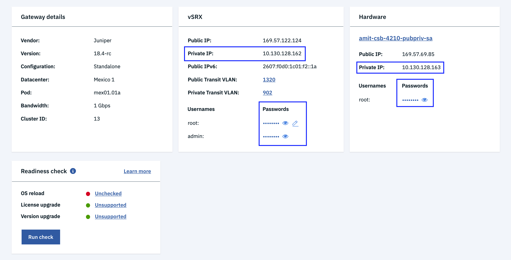

---

copyright:
  years: 2018, 2021
lastupdated: "2021-02-26"

keywords: readiness errors

subcollection: vsrx

---

{:shortdesc: .shortdesc}
{:new_window: target="_blank_"}
{:codeblock: .codeblock}
{:pre: .pre}
{:screen: .screen}
{:tip: .tip}
{:note: .note}
{:important: .important}
{:download: .download}
{:help: data-hd-content-type='help'}
{:support: data-reuse='support'}
{:external: target="_blank" .external}

# Correcting readiness errors and warnings
{: #correcting-readiness-errors}

Readiness errors and warnings can inhibit your ability to succesfully complete a readiness check. This topic provides information on correcting different types of errors and warnings.
{: shortdesc}

## Correcting connectivity errors
{: #connnectivity-errors}

There are two categories of connectivity errors that you might encounter when performing readiness checks:

  * Host (Ubuntu) SSH connectivity errors
  * Gateway (vSRX) SSH connectivity errors

Many of these errors result from the fact that the gateway actions being checked require root SSH access to the private IP address for either the host (Ubuntu) OS, or the gateway (vSRX). If an SSH connectivity check fails, then the action cannot proceed.

  For more information about establishing an SSH session, see [Accessing the device using SSH](/docs/vsrx?topic=vsrx-performing-ibm-cloud-juniper-vsrx-basics#accessing-the-device-using-ssh). Note that for step 3, the example given is with the `admin` user. For a readiness check, substitute the `root` user for both the vSRX and the Hardware (host). Also, make sure that you use your private IP with this procedure, not your public IP.
  {: note}

To validate connectivity, open an SSH session to either the Ubuntu host's or vSRX's private IP using the root credentials listed in the **Hardware** section (for an Ubuntu host) or the **vSRX** section (for the gateway) of the [Gateway Appliance Details](/docs/vsrx?topic=gateway-appliance-viewing-gateway-appliance-details) page. Ensure that the SSH session can be established.

  

If the session cannot be established, check the following potential issues.

For host (Ubuntu) SSH connectivity errors:

  * Is the Ubuntu firewall blocking SSH access to the private IP? The firewall rules must allow SSH access to the private `10.0.0.0/8` subnet. For more information, see [IBM Cloud IP ranges](/docs/hardware-firewall-shared?topic=hardware-firewall-shared-ibm-cloud-ip-ranges#service-network-on-backend-private-network-) for the service network.
  * Is the root password listed on the Gateway Appliance Details page the correct password for the root user?
    If not, click the device link in the **Hardware** section and navigate to **Passwords**. Select **Actions > Edit credentials** and change the password to match the actual root password on the Ubuntu host.
  * Is the root login disabled for the SSH server? 
  * Is the SSH server disabled or stopped?
  * Is the root user account disabled on the Ubuntu host?

For gateway (vSRX) SSH connectivity errors:

  * Is the vSRX firewall blocking SSH access to the private IP? The firewall rules must allow SSH access to the private `10.0.0.0/8` subnet. For more information, see [IBM Cloud IP ranges](/docs/hardware-firewall-shared?topic=hardware-firewall-shared-ibm-cloud-ip-ranges#service-network-on-backend-private-network-) for the service network.
  * Is the root password listed on the Gateway Appliance Details page the correct password for the root user?
    If not, click the **Edit** icon  next to the root password and change the password to match the actual root password for the vSRX.
  * Is the root user account disabled for SSH access to the vSRX?

## Correcting error 1124
{: #correcting-1124}

vSRX 18.4R1-S1 introduced an incompatibility documented in this [Juniper problem report](https://prsearch.juniper.net/InfoCenter/index?page=prcontent&id=PR1407295){: external}. You require a Juniper account to access this report.

If a redundant Ethernet (reth) interface includes `vlan-tagging` (which is the default), then the interface must also include the `vlan-id` tag. In 18.4R1-S1, it was possible to commit a configuration without the `vlan-id` tag. Newer versions, such as 19.4R2-S3, do not allow this configuration. 

An example configuration without the `vlan-id`:

```
set interfaces reth2 vlan-tagging 
set interfaces reth2 mtu 9000 
set interfaces reth2 redundant-ether-options redundancy-group 1 
set interfaces reth2 unit 2058 family inet address xx.xx.xxx.1/26 
commit check
```
{:codeblock}

The output for this configuration is: 

```
root@vSRX-Node0# commit check 
[edit interfaces reth2]
 ‘unit 2058’
   VLAN-ID must be specified on tagged ethernet interfaces
error: configuration check-out failed
```
{:codeblock}

To address this error, add the `vlan-id `tag to the configuration and retry the readiness check:

```
set interfaces reth2 unit 2058 vlan-id 2058
```
{:pre}

## Correcting error 1125
{: #correcting-1125}

vSRX 18.4R1-S1 introduced an incompatibility that allowed the syslog configuration to contain both the `structure-data` and `explicit-priority` labels. In versions 19.4R2-S3 and later, this is no longer allowed. 

For example, the following syslog configuration contains both labels (`set system syslog file messages structured-data` and `set system syslog file default-log-messages explicit-priority`).

```
set system syslog file messages any info
set system syslog file messages authorization warning
set system syslog file messages archive size 10m
set system syslog file messages archive files 10
set system syslog file messages archive world-readable
set system syslog file messages structured-data
set system syslog file interactive-commands interactive-commands info
set system syslog file interactive-commands archive size 1m
set system syslog file interactive-commands archive files 10
set system syslog file interactive-commands archive world-readable
set system syslog file interactive-commands structured-data
set system syslog file default-log-messages any warning
set system syslog file default-log-messages authorization info
set system syslog file default-log-messages user info
set system syslog file default-log-messages firewall any
set system syslog file default-log-messages interactive-commands info
set system syslog file default-log-messages explicit-priority
set system syslog file default-log-messages structured-data
set system syslog file kmd-logs daemon info
commit check
```
{:codeblock}

The output for this configuration is:

```
[Stage 3 - Build_vSRX][2021-01-11 15:38:00.623323] Commit check failed: CommitError(edit_path: [edit system syslog file default-log-messages], bad_element: explicit-priority, message: error: ‘explicit-priority’ cannot be configured if ‘structured-data’ is configured
error: configuration check-out failed: (statements constraint check failed))
```
{:codeblock}

To fix this issue, remove one of the syslog labels from the configuration and retry the readiness check.

## Correcting warning 1176
{: #correcting-1176}

A VPN configuration with `establish-tunnels` not set to `immediately` was detected. After an upgrade, the IKE might not be immediately active depending on negotiations with the remote peer gateway, and whether or not data traffic is actively flowing. Without `establish-tunnels immediately`, the tunnel is established with `on-traffic`. With the `establish-tunnels immediately` statement, the tunnel is established immediately when the configuration is committed. However, `establish-tunnels immediately` might trigger an undesirable outcome when configured on both ends of the tunnel. 

For more information on this issue, see [[SRX] IPSec comes UP when SRX-A is the Initiator, but fails when SRX-A becomes the responder ](https://kb.juniper.net/InfoCenter/index?page=content&id=KB22239){:external} in the Juniper Knowledge Base. Consult [vpn (Security)](https://www.juniper.net/documentation/en_US/junos/topics/reference/configuration-statement/security-edit-vpn.html){: external} for more details on these settings.

## Correcting warning 1177
{: #correcting-1177}

One or more security zone policy rules with the `dynamic-application any` configuration was detected. If the vSRX is not installed with the Content Security Bundle (CSB) license and application signature database, then this configuration might cause traffic disruption due to changes in newer vSRX releases, such as 19.4R2-S3. 

For example, the following security policy configuration contains the `dynamic-application any` label:

```
set security policies from-zone untrust to-zone untrust policy DYNAMIC-APPLICATION-POLICY-LOCAL match dynamic-application any
set security policies from-zone untrust to-zone untrust policy DYNAMIC-APPLICATION-POLICY-LOCAL match source-address SL8
set security policies from-zone untrust to-zone untrust policy DYNAMIC-APPLICATION-POLICY-LOCAL match destination-address SL8 
set security policies from-zone untrust to-zone untrust policy DYNAMIC-APPLICATION-POLICY-LOCAL then permit  
```
{:codeblock}

If you are using a similar configuration, it is recommended that you either install the CSB license and the application signature database or remove the `dynamic-application any` rule.
