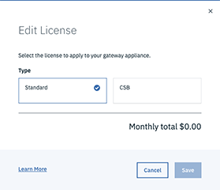

---

copyright:
  years: 2018
lastupdated: "2020-06-09"

keywords: license, viewing, changing

subcollection: vsrx

---

{:shortdesc: .shortdesc}
{:new_window: target="_blank_"}
{:codeblock: .codeblock}
{:pre: .pre}
{:screen: .screen}
{:tip: .tip}
{:download: .download}
{:note: .note}
{:important: .important}

# Viewing and changing vSRX licenses
{: #vsrx-licenses}

The vSRX has two available licenses:

* Standard
* Content Security Bundle (CSB)

For information on the features offered with these licenses, refer to [Choosing a vSRX License](/docs/vsrx?topic=vsrx-getting-started#choosing-license).

To view your current license, perform the following procedure:

1. From your browser, open [https://cloud.ibm.com ](https://cloud.ibm.com){:new_window} and log in to your account.
2. Select the Menu icon    from the top left, then click **Classic Infrastructure**.
3. Choose **Network > Gateway Appliances**.
4. Click the Gateway Appliance Name to access the Gateway Appliance Details page.

To change your current license, perform the steps above, then:

1. Click the Edit icon    next to your current license to edit it.

  

2. Select your new license type, then click **Save**.

  
